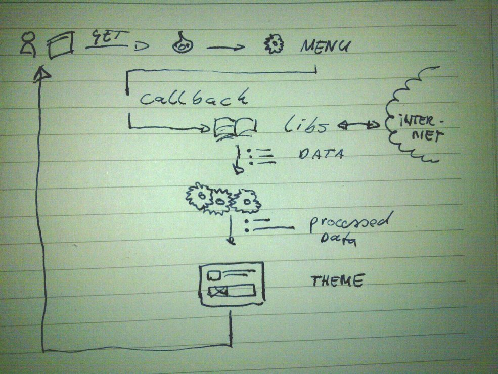

!SLIDE bullets incremental
# Connecting Drupal to a Service #
## Drupal _Pulls from_ External ##
* There is a module that (almost) does that.
* FeedAPI. 
* BatchAPI.
* Menu-handler. 

!SLIDE bullets incremental
# Menu-handler #
* Write your own code.
* KISS. (performant, managable, quick and to the point)
* Not at all hard.

!SLIDE bullets incremental
# Demo #
* Fetch a shop from Etsy.
* Just display it.
* Oh, no. Actually, only show items whose price >$14,00 (Not included)
* And, could you add an advertisement every fourth item? (Not included)

!SLIDE center
# And it should look like this #

!SLIDE center
# And this is how it works, kinda #

!SLIDE
# Demo #

!SLIDE code
# Tools #
    @@@ PHP
    hook_menu();
    drupal_http_request();
    SimpleXML::simple_xml_parse_string();
    SOAP::WSDL
    drupal::cache_set() && cache_get();
    hook_cron();

