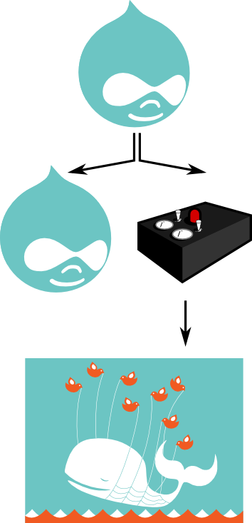

!SLIDE bullets incremental
# Pushing data from Drupal into Remote #
* There is a module that (almost) does that. 
* Just run your own code:
 * `hook_form_alter()`, adds a _submit callback_, which pushes data into remote.
* Be carefull with _actions_, often cannot handle errors from remote.
* _You must_ handle errors from remote, submit-callback is not atomic!.

!SLIDE center

!SLIDE center

!SLIDE bullets incremental
# Asynchronous #
* You probably want this asyncronous. 
* Meaning: 
 * submit-callback registers a job.
 * a (bunch of) worker(s) pick up jobs and run them.
* Drupal has no worker-queues, though.
* Drupal uses spooling and cron-jobs (yuk).
